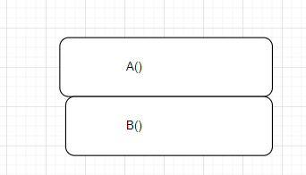

In Java objects are created and destroyed(abandoned)

The programmer decides when and how to construct an object as well as how to destroy it

Once an object is abandoned, the Garbage Collector erases it and reclaims the memory space it was allocated.
#
#
### The STACK and The HEAP


Objects live on the Garbage-Collectible Heap

*****Local variables***** live within the method they are created in. They are temporary and live only as long as the method is on the stack.
Declared inside a method or method parameter.
Local variables live on the stack ---within the stack frame of the method they belong to.

They are contained within the curly braces of a method and once a method is called and runs all the code in the curly braces
 the local variable is abandoned.

*****Instance Variables*****


Declared inside a class, but outside a method. 

Instance variable live on the heap.
They live inside the object they belong to.

When a method is called it lands on top of a call stack as a *****stack frame*****.

The stack frame holds the state of the methods, including the values of the local variables inside the method.
The specific line of code that is executing is also held by the stack frame.

The method at the top of the stack is usually the one currently running.
A method stays on the stack until it hits its closing curly brace.
It method A calls method B, method B stacks on top of A until A is done executing


Where a method contains a local variable that is an object, the local variable only holds the reference to the object that lives on the heap, and not the object itself.
When this method is called its local variable(*****reference to object on the heap*****) is what lands on the stack frame.


### CONSTRUCTORS AND THE GARBAGE-COLLECTIBLE HEAP
An object is created when its constructor is called.
A constructor has the same name as the class name and no return type.
A constructor is the code that runs where the new keyword is used.
```
CellPhone phone = new CellPhone();

//there are three steps to creating an object
//Declaring  reference in this case  CellPhone phone;
//Creating the object   new CellPhone()
//Assigning the new object to the reference  CellPhone phone = new CellPhone();


```

A constructor can only be invoked by the use of the *****new***** keyword

Even when we don't write a constructor method in a class, Java provides a default constructor and this is what is used to create objects of that class.
A constructor runs before the object can be assigned to a reference.
Constructors can be used to initialize important object states when creating the object.
This is achieved by the use of instance variable which can be set when we are assigning a reference to a new object.

The best way to achieve this is by making a constructor with arguments so that when a user creates an object they have to assign the object's states as well.
```
//for instance if CellPhone objects have a color state and price state
//we can specify this in the constructor
//this forces a user to enter the CellPhone's state when it is created

public CellPhone(String color, double price){}

//when a CellPhone object is created it has to have a color and price

CellPhone phone = new CellPhone("Red", 1599.0);

```

Constructors work with setters and getters to allow for an objects state to be set during creation and to be retrieved where needed.


Once we have a constructor with arguments we no longer have access to the default constructor that Java provides and therefore have to create one ourselves if we want to be able to create objects without initializing their state.
We can have multiple constructors in a class as long as their arguments lists are different.
This is referred to as constructor overloading and works much the same as method overloading.
The number of constructors present determines the number of ways to create an object of the class they are in.


### ON INHERITANCE AND CONSTRUCTORS
When an object is created, the HEAP creates space for the instance variables it has as well as those it inherits from its superclasses.
Only one object is created but it contains parts of itself as well as parts of the classes higher in the hierarchy.
All the constructors in an object's inheritance tree must run when the object is created.
Invoking the new keyword starts a constructor chain reactions.
Even the abstract classes in an object's hierarchy tree will have their constructors run.
When a constructor runs it calls its superclass constructor and goes all the way up the chain of constructors to Java's object class constructor.
This process is referred to as *****CONSTRUCTOR CHAINING*****.


This means that the constructors stack on top of each other as they call the constructor higher up in the hierarchy.

The compiler silently calls the super() constructor in a concrete class's constructor unless we specifically call the super ourselves.
The superclass parts of an object are formed before its actual parts are formed.
The call to super() must therefore be the first statement in each constructor.


We can invoke an overloaded constructor from another within the same class
```
public abstract class House{
    private int size;

    public int getSize() {
        return size;
    }

    public void setSize(int size) {
        this.size = size;
    }
    
    public House(int size) {
        this.size = size;
    }
}
```
```
public class Bungalow extends House{
    private int rooms;

    public int getRooms() {
        return rooms;
    }

    public void setRooms(int rooms) {
        this.rooms = rooms;
    }
    
    //Using the this() keyword to call an overloaded constructor in the same class
    //we cannot call super in this constructor as well
    //the this() constructor is the one that does all the work here
    //the constructor calling this does nothing beyoond calling the constructor that actually does the work of creating the object
    public Bungalow(){
        this(7);
    }
    
    //This is allowed as we are invoking super in this overloaded constructor
    public Bungalow(int rooms){
        super(4000);
        this.rooms = rooms;

    }
    
    
    //THIS IS ILLEGAL AS WE CANNOT USE BOTH this() AND super()
    public Bungalow(int size){
        this(7);
        super(size);
    }
}
```


How long an object lives depends on the references referring to it.
A local variable lives within the method it is contained in and only for as long as the method is still on the stack. Once the object is done executing and is popped of the stack, the variable no longer exists.
A local variable is in scope only within the containing method. No other code within the class can see it.


An instance variable lives as long as the object referring to it is alive.


An objects life depends on the variables referencing it. 
Whenever there are no longer any references to an object, it becomes eligible for collection

```
House a = new House();
//Here variable a is set to reference a new house object
//the object is alive and on the heap and variable a exists for that reason
    
    a = new House();

    
    //Here variable a is assigned to reference a new object
    //the previous object is abandoned and becomes eligible for collection by the GC
    
    a = null;
    //Here variable a is assigned to reference nothing and thus the second object is abandoned and becomes eligible to be destroyed by the GC
```

An object is hence destroyed when it is no longer in scope, when it's referrence variable is assigned to a new object or when it's referrence is assigned to null.


###  NUMBERS MATTER

Regular(NON-STATIC) vs STATIC Methods
The keyword *****static***** lets a method run without any instance of the class.
A static method refers to behaviour that is not dependent on an instance variable. No instance or object is required to usee a static method
You only need the class.
Static methods are called using the class name:
```
Math.min()
Math.round()
Math.max()
Math.abs()

//These are all static methods belonging to the Java Math class
```

Non-static methods are called on the reference variable name:
```
Dog dog = new Dog();
dog.bark();
dog.eat();
dog.sleep();
dog.barkAgain();

```

Often, but not always classes with static methods are not meant to be instantiated.
This usually requires making the constructor *****private***** so that the new keyword would not work to create an instance of that class.

When a method or constructor is marked private, only code from within the class can access it.


Static methods can't use nos-static variables or methods because non-static variable and methods have to be used on an instance of the class.
Non-static methods can call static methods and access static variables in a class.
Static variables are shared by all instances of a particular class.
```
public class MonsterWheel{
private int id;
public static uniqueID = 0; //this is a static variable

//whenever a new MonsterWheel instance is created the ID updates and gives each one a unique id

public MonsterWheel(){
uniqueID++;
id = uniqueID;
}
}

```

All static variables in a class are initialized before any object of that class can be created and before any static method of the class runs.
We can declare a static variable without initializing it. It will be assigned a default value of that variable type.
They are automatically initialized when the class is loaded.


Static final variables are constants. They can never be changed.
An example is *****Math.PI*****
Static final variables are usually named in allCAPS and have to be initialized when declared.


Non-static variables can also be final and that means their value doesn't change. The compiler would complain  if we tried to change them.
A method denoted as final cannot be overridden.
A class denoted as final cannot be extended by another class.
An example of a final class is the String class.

If a class is final, the methods in it don't need to be marked as final.


